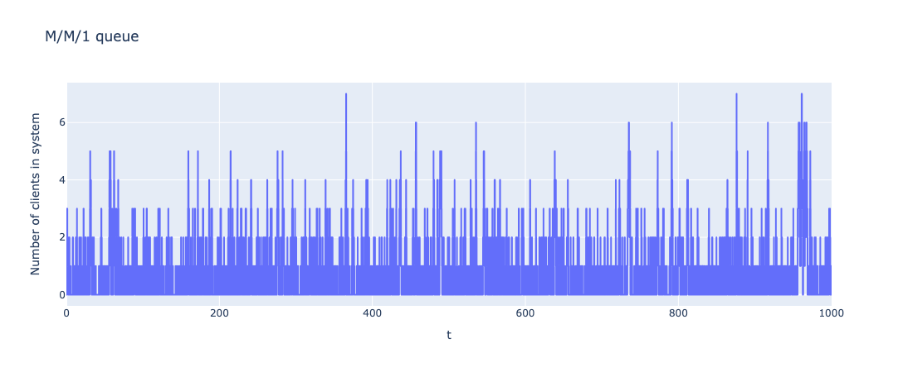
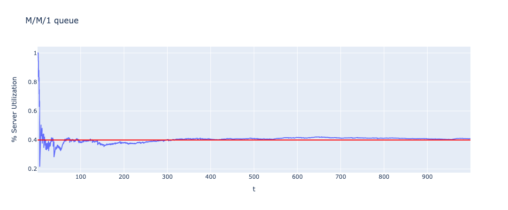
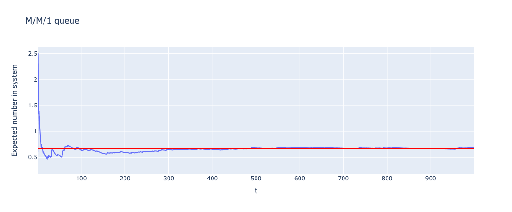

# mm1_queue
This repository contains a Jupyter Notebook which allows to simulate the trajectories of a M/M/1 queue for an arbitrary arrival rate $\lambda$ and service rate $\mu$, given a fixed temporal horizon $T$.

The simulation function is implemented in C to achieve performance over long duration trajectories, but the function is wrapped in Python using the ctypes library, allowing to call the function directly from a notebook in order to plot the resulting trajectory and other metrics.

Simulation project for the Stochastic Processes course of my Mathematics BSc.

## Dependencies
* Python 3.10
* NumPy
* ctypes
* Plotly        

## Example
Results for a random trajectory with $\lambda = 2$, $mu = 5$ and $T = 1000$:
* Trajectory: 
* % server utilization: 
* Expected number in system: 
